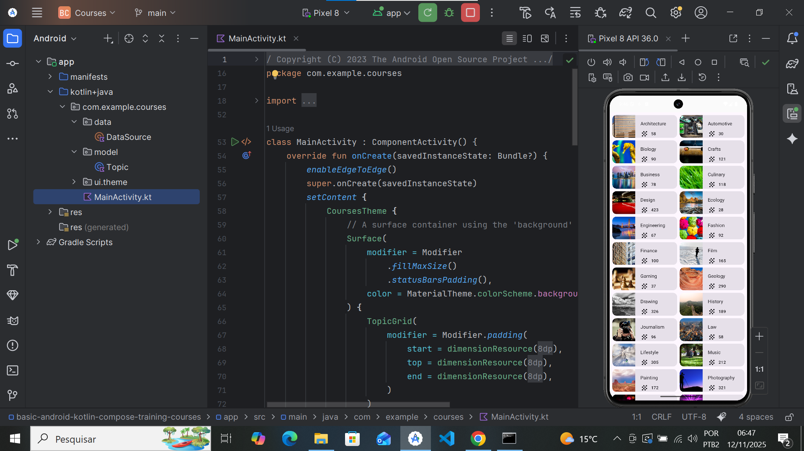

# App-Grade - Lista em Grade com Jetpack Compose

Aplicativo Android que exibe uma grade rolável de tópicos, desenvolvido com Jetpack Compose como prática do curso "Android Basics with Compose".



## Sobre o Projeto

O app Courses (App-Grade) contém uma grade rolável com diversos cards, cada um representando um tópico de curso com uma imagem, título e contagem de cursos associados. O objetivo é praticar a criação de layouts em grade.

## Funcionalidades

-   Grade rolável usando `LazyVerticalGrid`.
-   Layout com duas colunas fixas.
-   Cards customizados com imagem, texto e ícone.
-   Design responsivo seguindo o Material 3.

## Pré-requisitos

Para executar este projeto, você precisa ter:

-   Familiaridade com listas e `LazyColumn` em Kotlin.
-   Experiência construindo layouts com Jetpack Compose.
-   Android Studio instalado.
-   Conhecimento básico de desenvolvimento Android.

## Como Executar

1.  Instale o Android Studio (caso ainda não tenha).
2.  Clone este repositório:

    ```bash
    git clone https://github.com/joaoxaviersilva/App-Grade.git
    ```

3.  Abra o projeto no Android Studio.
4.  Aguarde o Gradle sincronizar as dependências.
5.  Execute o app em um emulador ou dispositivo físico.

## Tecnologias Utilizadas

-   Kotlin
-   Jetpack Compose
-   `LazyVerticalGrid`
-   Material Design 3
-   Android SDK

## Créditos das Imagens

Todas as imagens e ícones são fornecidos pelo curso "Android Basics with Compose" da Google.

## Licença

Este projeto utiliza código do "Android Basics with Compose", licenciado sob Apache License 2.0.

---

Desenvolvido como parte do curso Android Basics with Compose.
